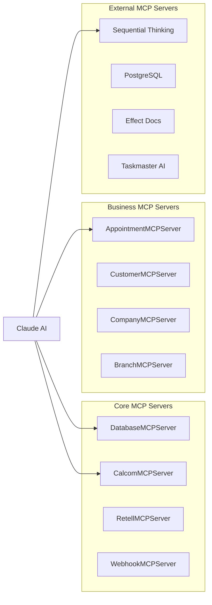

# Model Context Protocol (MCP) Servers

Generated on: 2025-06-23 16:14:17

## Overview

AskProAI implements 12 internal MCP servers and supports 4 external MCP servers for enhanced AI capabilities.

## Internal MCP Servers

## Server Details

### AppointmentMCPServer

**Available Methods**:
- `getAppointment()`
- `createAppointment()`
- `updateAppointment()`
- `cancelAppointment()`
- `checkAvailability()`
- `getAppointmentsByDateRange()`

### BranchMCPServer

**Available Methods**:
- `getBranch()`
- `getBranchesByCompany()`
- `createBranch()`
- `updateBranch()`
- `getBranchStaff()`
- `getBranchServices()`
- `getBranchWorkingHours()`
- `isBranchOpen()`

### CalcomMCPServer

**Available Methods**:
- `getEventTypes()`
- `checkAvailability()`
- `getBookings()`
- `updateEventTypeSettings()`
- `generateCalcomDirectLink()`
- `validateEventTypeConfiguration()`
- `getEventTypeAssignments()`
- `syncEventTypesWithDetails()`
- `syncUsersWithSchedules()`
- `createBooking()`
- `syncEventTypes()`
- `testConnection()`
- `updateBooking()`
- `cancelBooking()`
- `findAlternativeSlots()`
- `clearCache()`

### CompanyMCPServer

**Available Methods**:
- `getCompany()`
- `createCompany()`
- `updateCompany()`
- `getCompanyStatistics()`
- `getIntegrationsStatus()`
- `updateSettings()`

### CustomerMCPServer

**Available Methods**:
- `getCustomer()`
- `createOrFindByPhone()`
- `updateCustomer()`
- `getCustomerAppointments()`
- `getCustomerCalls()`
- `checkBlacklist()`
- `updatePreferences()`
- `searchCustomers()`

### DatabaseMCPServer

**Available Methods**:
- `getSchema()`
- `query()`
- `getFailedAppointments()`
- `getCallStats()`
- `search()`
- `getTenantStats()`
- `clearCache()`
- `getPhoneBranchMapping()`

### DistributedTransactionManager

**Available Methods**:
- `begin()`
- `addOperation()`
- `execute()`
- `commit()`
- `rollback()`
- `restore()`
- `getStatus()`
- `executeWithRetry()`

### ExternalMCPManager

**Available Methods**:
- `startServer()`
- `stopServer()`
- `stopAll()`
- `isServerRunning()`
- `getStatus()`
- `restartServer()`
- `startAll()`
- `healthCheck()`

### KnowledgeMCPServer

**Available Methods**:
- `getCompanyKnowledge()`
- `searchKnowledge()`
- `updateKnowledge()`
- `getContextForAI()`
- `getCategoryKnowledge()`
- `createFromTemplate()`
- `getStatistics()`
- `getDocumentCount()`

### MCPBookingOrchestrator

**Available Methods**:
- `handleWebhook()`
- `checkAvailability()`
- `findAlternatives()`

### MCPCacheWarmer

**Available Methods**:
- `warmAll()`
- `clearAll()`
- `getStats()`

### MCPConnectionPoolManager

**Available Methods**:
- `optimizePool()`
- `healthCheck()`
- `getMetrics()`
- `configure()`

### MCPContextResolver

**Available Methods**:
- `resolveFromPhone()`
- `resolveFromCompany()`
- `setTenantContext()`
- `getCurrentContext()`
- `clearTenantContext()`
- `invalidateCache()`

### MCPHealthCheckService

**Available Methods**:
- `checkSystemHealth()`
- `getDetailedHealth()`
- `checkServiceHealth()`

### MCPMetricsCollector

**Available Methods**:
- `recordMetric()`
- `getServiceHealth()`
- `getTotalRequests()`
- `getSuccessRate()`
- `getAverageResponseTime()`
- `getCacheHitRate()`
- `getActiveCircuitBreakers()`
- `getActiveAlerts()`
- `getPrometheusMetrics()`
- `getServiceMetrics()`

### MCPOrchestrator

**Available Methods**:
- `route()`
- `enforceQuotas()`
- `healthCheck()`
- `getMetrics()`
- `getService()`
- `warmup()`

### MCPQueryOptimizer

**Available Methods**:
- `startMonitoring()`
- `stopMonitoring()`
- `explainQuery()`
- `createSuggestedIndexes()`
- `getDatabaseStats()`

### MCPRequest

**Available Methods**:
- `fromArray()`
- `getId()`
- `getService()`
- `getOperation()`
- `getParams()`
- `getParam()`
- `getTenantId()`
- `getMetadata()`
- `getCorrelationId()`
- `setParam()`
- `setMetadata()`
- `toArray()`
- `withParams()`
- `forOperation()`

### MCPResponse

**Available Methods**:
- `success()`
- `error()`
- `fromException()`
- `isSuccess()`
- `getData()`
- `getError()`
- `getMetadata()`
- `getTimestamp()`
- `getMeta()`
- `withMetadata()`
- `getExecutionTime()`
- `toArray()`
- `toJson()`
- `toHttpResponse()`
- `throwIfError()`
- `map()`
- `getDataOr()`

### MCPServiceRegistry

**Available Methods**:
- `register()`
- `get()`
- `getService()`
- `has()`
- `getAllServices()`
- `getServiceNames()`
- `getHealthStatus()`

### QueueMCPServer

**Available Methods**:
- `getOverview()`
- `getFailedJobs()`
- `getRecentJobs()`
- `getJobDetails()`
- `retryJob()`
- `getMetrics()`
- `getWorkers()`
- `searchJobs()`
- `clearCache()`

### RetellMCPServer

**Available Methods**:
- `getAgent()`
- `listAgents()`
- `syncAgentDetails()`
- `getCallStats()`
- `getRecentCalls()`
- `getCallDetails()`
- `searchCalls()`
- `testConnection()`
- `getPhoneNumbers()`
- `clearCache()`
- `importRecentCalls()`
- `importCalls()`
- `updateAgent()`
- `getTranscript()`
- `healthCheck()`
- `validateAndFixAgentConfig()`
- `testWebhookEndpoint()`
- `syncPhoneNumbers()`
- `updateAgentPrompt()`
- `getAgentsWithPhoneNumbers()`
- `testPhoneNumber()`
- `getAgentVersions()`
- `setPhoneNumberAgentVersion()`
- `getAgentVersionDetails()`

### SentryMCPServer

**Available Methods**:
- `listIssues()`
- `getIssue()`
- `getLatestEvent()`
- `searchIssues()`
- `getPerformanceData()`
- `clearCache()`

### StripeMCPServer

**Available Methods**:
- `getPaymentOverview()`
- `getCustomerPayments()`
- `createInvoice()`
- `processRefund()`
- `getSubscription()`
- `updateSubscription()`
- `generateReport()`
- `testConnection()`

### SyncMCPService

**Available Methods**:
- `syncCalls()`
- `syncAppointments()`
- `previewSync()`
- `getSyncRecommendations()`

### UIUXBestPracticesMCP

**Available Methods**:
- `analyzeCurrentImplementation()`
- `getSuggestions()`
- `monitorTrends()`
- `suggestComponents()`

### WebhookMCPServer

**Available Methods**:
- `processRetellWebhook()`
- `getWebhookStats()`

### WebhookMCPServerFixed

**Available Methods**:
- `processRetellWebhook()`
- `getWebhookStats()`

