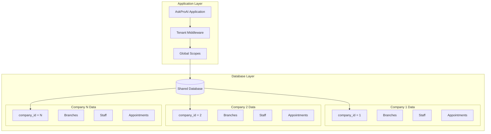

# Multi-Tenancy Architecture

## Overview

AskProAI implements a robust multi-tenant architecture that allows multiple companies to use the platform while maintaining complete data isolation, customization, and security. Each company (tenant) operates in their own virtual environment with their data, settings, and integrations.

## Architecture Model

### Shared Database, Separate Schema



## Tenant Identification

### 1. Subdomain-Based

```php
// tenant1.askproai.de → Company 1
// tenant2.askproai.de → Company 2

class TenantIdentificationMiddleware
{
    public function handle($request, Closure $next)
    {
        $subdomain = explode('.', $request->getHost())[0];
        
        $company = Company::where('subdomain', $subdomain)
            ->where('active', true)
            ->first();
            
        if (!$company) {
            abort(404, 'Company not found');
        }
        
        // Set tenant context
        app()->instance('tenant', $company);
        Config::set('app.tenant_id', $company->id);
        
        return $next($request);
    }
}
```

### 2. Header-Based (API)

```php
// X-Company-ID: 1 → Company 1

class ApiTenantMiddleware
{
    public function handle($request, Closure $next)
    {
        $companyId = $request->header('X-Company-ID');
        
        if (!$companyId) {
            return response()->json(['error' => 'Company ID required'], 400);
        }
        
        $company = Company::find($companyId);
        
        if (!$company || !$this->userBelongsToCompany($company)) {
            return response()->json(['error' => 'Unauthorized'], 403);
        }
        
        app()->instance('tenant', $company);
        
        return $next($request);
    }
}
```

## Data Isolation

### Global Scopes

Every model with tenant data automatically filters by company:

```php
trait BelongsToCompany
{
    protected static function bootBelongsToCompany()
    {
        // Auto-add company_id when creating
        static::creating(function ($model) {
            if (!$model->company_id && app()->has('tenant')) {
                $model->company_id = app('tenant')->id;
            }
        });
        
        // Auto-filter by company_id when querying
        static::addGlobalScope('company', function (Builder $builder) {
            if (app()->has('tenant')) {
                $builder->where($builder->getModel()->getTable() . '.company_id', app('tenant')->id);
            }
        });
    }
    
    public function company()
    {
        return $this->belongsTo(Company::class);
    }
}
```

### Model Implementation

```php
class Appointment extends Model
{
    use BelongsToCompany;
    
    // All queries automatically filtered by company_id
    // Appointment::all() → Only returns current tenant's appointments
}

class Customer extends Model
{
    use BelongsToCompany;
    
    // Customer::find(1) → Only if customer belongs to current tenant
}
```

## Tenant Configuration

### Company Settings

```php
Schema::create('companies', function (Blueprint $table) {
    $table->id();
    $table->string('name');
    $table->string('subdomain')->unique();
    $table->string('domain')->nullable(); // Custom domain
    $table->json('settings');
    $table->json('features'); // Feature flags
    $table->string('timezone')->default('Europe/Berlin');
    $table->string('locale')->default('de_DE');
    $table->string('currency')->default('EUR');
    $table->boolean('active')->default(true);
    $table->timestamp('trial_ends_at')->nullable();
    $table->string('stripe_customer_id')->nullable();
    $table->timestamps();
});
```

### Tenant-Specific Settings

```json
{
  "branding": {
    "primary_color": "#2563eb",
    "logo_url": "https://...",
    "company_name": "Hair Salon Berlin"
  },
  "booking": {
    "advance_booking_days": 30,
    "minimum_notice_hours": 2,
    "cancellation_hours": 24,
    "max_bookings_per_day": 50
  },
  "notifications": {
    "sms_enabled": true,
    "email_enabled": true,
    "whatsapp_enabled": false,
    "reminder_hours": [24, 2]
  },
  "integrations": {
    "calcom_enabled": true,
    "google_calendar_enabled": false,
    "stripe_enabled": true
  }
}
```

## Feature Management

### Feature Flags

```php
class FeatureFlag
{
    public static function enabled(string $feature, ?Company $company = null): bool
    {
        $company = $company ?? app('tenant');
        
        // Global feature flags
        if (!config("features.{$feature}.enabled", true)) {
            return false;
        }
        
        // Company-specific flags
        $companyFeatures = $company->features ?? [];
        
        // Check if explicitly disabled for company
        if (isset($companyFeatures[$feature])) {
            return $companyFeatures[$feature];
        }
        
        // Check if feature requires specific plan
        $requiredPlan = config("features.{$feature}.required_plan");
        if ($requiredPlan) {
            return $company->plan->tier >= $requiredPlan;
        }
        
        return true;
    }
}

// Usage
if (FeatureFlag::enabled('advanced_analytics')) {
    // Show advanced analytics
}
```

### Plan-Based Features

```php
enum PlanTier: int
{
    case FREE = 1;
    case STARTER = 2;
    case PROFESSIONAL = 3;
    case ENTERPRISE = 4;
}

class Plan extends Model
{
    protected $casts = [
        'tier' => PlanTier::class,
        'limits' => 'array',
        'features' => 'array',
    ];
    
    public function allows(string $feature): bool
    {
        return in_array($feature, $this->features);
    }
    
    public function getLimit(string $resource): int
    {
        return $this->limits[$resource] ?? 0;
    }
}
```

## Resource Limits

### Usage Tracking

```php
class UsageTracker
{
    public function track(Company $company, string $resource, int $amount = 1)
    {
        $usage = CompanyUsage::firstOrCreate([
            'company_id' => $company->id,
            'resource' => $resource,
            'period' => now()->format('Y-m'),
        ]);
        
        $usage->increment('count', $amount);
        
        // Check limits
        if ($this->exceedsLimit($company, $resource, $usage->count)) {
            throw new LimitExceededException($resource);
        }
    }
    
    public function exceedsLimit(Company $company, string $resource, int $current): bool
    {
        $limit = $company->plan->getLimit($resource);
        return $limit > 0 && $current > $limit;
    }
}
```

### Resource Limits by Plan

```yaml
Free Plan:
  appointments_per_month: 50
  staff_members: 2
  branches: 1
  sms_per_month: 0
  api_calls_per_hour: 100

Professional Plan:
  appointments_per_month: 1000
  staff_members: 10
  branches: 3
  sms_per_month: 500
  api_calls_per_hour: 1000

Enterprise Plan:
  appointments_per_month: unlimited
  staff_members: unlimited
  branches: unlimited
  sms_per_month: unlimited
  api_calls_per_hour: 10000
```

## Database Design

### Tenant-Aware Tables

All business tables include `company_id`:

```sql
-- Core tables with tenant isolation
CREATE TABLE appointments (
    id BIGINT PRIMARY KEY,
    company_id BIGINT NOT NULL,
    branch_id BIGINT NOT NULL,
    customer_id BIGINT NOT NULL,
    staff_id BIGINT NOT NULL,
    start_time TIMESTAMP NOT NULL,
    -- ... other fields
    FOREIGN KEY (company_id) REFERENCES companies(id),
    INDEX idx_company_appointments (company_id, start_time)
);

CREATE TABLE customers (
    id BIGINT PRIMARY KEY,
    company_id BIGINT NOT NULL,
    name VARCHAR(255) NOT NULL,
    phone VARCHAR(50),
    email VARCHAR(255),
    -- ... other fields
    FOREIGN KEY (company_id) REFERENCES companies(id),
    INDEX idx_company_customers (company_id, phone),
    UNIQUE KEY uk_company_email (company_id, email)
);
```

### Shared Tables

Some tables are shared across tenants:

```sql
-- Shared system tables
CREATE TABLE plans (
    id BIGINT PRIMARY KEY,
    name VARCHAR(100),
    tier INT,
    price DECIMAL(10,2),
    features JSON,
    limits JSON
);

CREATE TABLE activity_logs (
    id BIGINT PRIMARY KEY,
    company_id BIGINT,
    user_id BIGINT,
    action VARCHAR(100),
    created_at TIMESTAMP,
    INDEX idx_company_activity (company_id, created_at)
);
```

## Security Considerations

### Cross-Tenant Protection

```php
class CrossTenantProtectionMiddleware
{
    public function handle($request, Closure $next)
    {
        $response = $next($request);
        
        // Verify response doesn't leak cross-tenant data
        if ($response->getStatusCode() === 200) {
            $this->validateResponseData($response);
        }
        
        return $response;
    }
    
    private function validateResponseData($response)
    {
        $data = $response->getData(true);
        $currentTenantId = app('tenant')->id;
        
        // Recursively check all data
        array_walk_recursive($data, function ($value, $key) use ($currentTenantId) {
            if ($key === 'company_id' && $value != $currentTenantId) {
                throw new CrossTenantDataLeakException();
            }
        });
    }
}
```

### Tenant Admin Isolation

```php
class TenantAdminPolicy
{
    public function viewAny(User $user): bool
    {
        return $user->hasRole('admin') && 
               $user->company_id === app('tenant')->id;
    }
    
    public function create(User $user): bool
    {
        // Check if company has capacity for more admins
        $currentAdmins = User::where('company_id', $user->company_id)
            ->whereHas('roles', fn($q) => $q->where('name', 'admin'))
            ->count();
            
        return $currentAdmins < $user->company->plan->getLimit('admin_users');
    }
}
```

## Customization

### White-Label Support

```php
class WhiteLabelService
{
    public function getCompanyBranding(Company $company): array
    {
        return [
            'name' => $company->settings['branding']['company_name'] ?? $company->name,
            'logo' => $company->settings['branding']['logo_url'] ?? asset('default-logo.png'),
            'colors' => [
                'primary' => $company->settings['branding']['primary_color'] ?? '#2563eb',
                'secondary' => $company->settings['branding']['secondary_color'] ?? '#7c3aed',
            ],
            'favicon' => $company->settings['branding']['favicon_url'] ?? asset('favicon.ico'),
            'email_footer' => $company->settings['branding']['email_footer'] ?? '',
        ];
    }
}
```

### Custom Domains

```nginx
# Nginx configuration for custom domains
server {
    server_name *.customdomain.com;
    
    location / {
        proxy_pass http://app;
        proxy_set_header X-Tenant-Domain $host;
        proxy_set_header Host api.askproai.de;
    }
}
```

## Monitoring & Analytics

### Tenant Metrics

```php
class TenantMetricsService
{
    public function getMetrics(Company $company): array
    {
        return Cache::remember("metrics:company:{$company->id}", 300, function () use ($company) {
            return [
                'appointments' => [
                    'total' => $company->appointments()->count(),
                    'this_month' => $company->appointments()->thisMonth()->count(),
                    'today' => $company->appointments()->today()->count(),
                ],
                'customers' => [
                    'total' => $company->customers()->count(),
                    'active' => $company->customers()->active()->count(),
                    'new_this_month' => $company->customers()->createdThisMonth()->count(),
                ],
                'revenue' => [
                    'this_month' => $company->appointments()
                        ->thisMonth()
                        ->completed()
                        ->sum('total_price'),
                ],
                'usage' => [
                    'api_calls' => $company->apiUsage()->today()->count(),
                    'sms_sent' => $company->notifications()->where('type', 'sms')->thisMonth()->count(),
                ],
            ];
        });
    }
}
```

### Tenant Health Monitoring

```php
class TenantHealthCheck
{
    public function check(Company $company): HealthStatus
    {
        $checks = [
            'database_connection' => $this->checkDatabaseConnection($company),
            'api_integration' => $this->checkApiIntegrations($company),
            'usage_limits' => $this->checkUsageLimits($company),
            'payment_status' => $this->checkPaymentStatus($company),
        ];
        
        $failed = array_filter($checks, fn($check) => !$check['passed']);
        
        return new HealthStatus(
            empty($failed) ? 'healthy' : 'unhealthy',
            $checks
        );
    }
}
```

## Best Practices

1. **Always Use Scopes**: Never query without tenant context
2. **Validate Tenant Access**: Double-check in critical operations
3. **Cache Per Tenant**: Include tenant ID in cache keys
4. **Monitor Cross-Tenant**: Log any suspicious access patterns
5. **Test Isolation**: Regular security audits
6. **Plan for Scale**: Design for thousands of tenants
7. **Document Limits**: Clear communication about plan limits