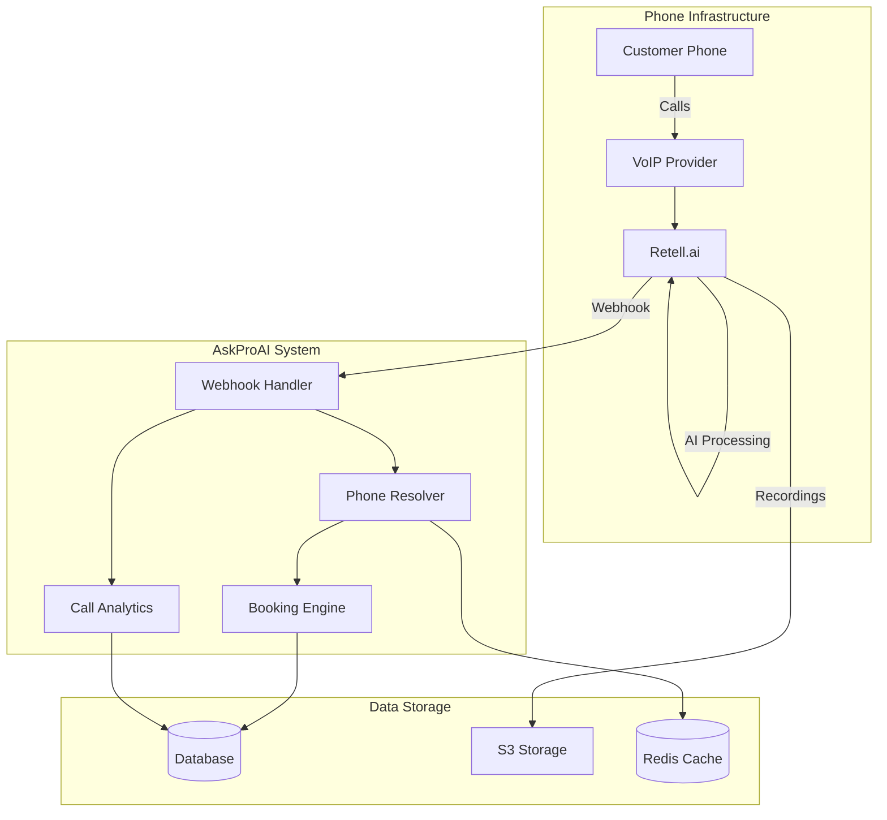
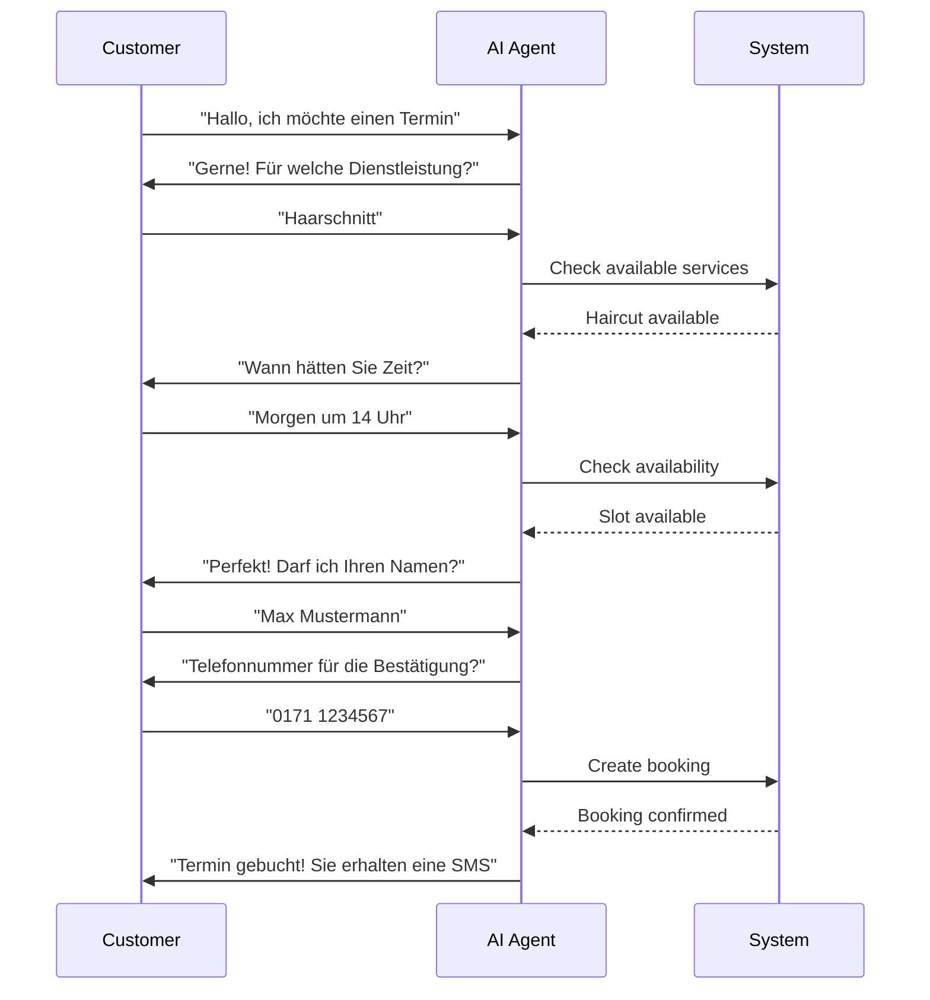

# Phone System

## Overview

The AskProAI phone system is the cornerstone of our automated appointment booking platform. It uses advanced AI technology from Retell.ai to handle incoming calls, understand customer requests in natural language, and book appointments automatically.

## Architecture



## Core Features

### 1. Multi-Language Support

The system supports over 30 languages with automatic detection:

- **German** (Primary): Native German speakers with regional dialects
- **English**: International customers
- **Turkish**: Large immigrant population
- **Arabic**: Growing customer base
- **And 26+ more languages**

### 2. Natural Language Understanding

```yaml
Customer Says: "Ich hätte gerne einen Termin für nächsten Dienstag vormittag"
AI Understands:
  - Intent: Book appointment
  - Date: Next Tuesday
  - Time: Morning (9:00-12:00)
  - Service: (Will ask if not mentioned)
```

### 3. Intelligent Call Routing

Phone numbers are mapped to specific branches and services:

```php
Phone: +49 30 123456 → Berlin Central → Haircut Services
Phone: +49 89 789012 → Munich North → Medical Services
Phone: +49 40 345678 → Hamburg Port → Legal Consultation
```

### 4. Context-Aware Conversations

The AI maintains context throughout the call:

```
AI: "Guten Tag, Sie rufen bei AskProAI Berlin an. Wie kann ich Ihnen helfen?"
Customer: "Ich brauche einen Haarschnitt."
AI: "Gerne! Wann hätten Sie denn Zeit?"
Customer: "Morgen nachmittag."
AI: "Ich schaue nach verfügbaren Terminen für morgen Nachmittag..."
```

## Phone Number Management

### Number Assignment

Each phone number is assigned to:
- **Company**: Multi-tenant isolation
- **Branch**: Specific location
- **AI Agent**: Customized personality and instructions
- **Services**: Available offerings

### Configuration

```sql
phone_numbers
├── id
├── phone_number: "+49 30 123456"
├── company_id: 1
├── branch_id: 3
├── retell_agent_id: "agent_abc123"
├── retell_phone_number_id: "pn_def456"
├── active: true
└── configuration: {
    "greeting": "Custom greeting",
    "voice": "emma",
    "language": "de-DE",
    "features": ["booking", "info", "cancellation"]
}
```

## AI Agent Configuration

### Agent Personality

Each AI agent can be customized:

```json
{
  "name": "Emma",
  "voice": "emma_german",
  "personality": "friendly, professional, efficient",
  "knowledge_base": [
    "services.json",
    "pricing.json",
    "policies.json"
  ],
  "instructions": "You are a helpful receptionist...",
  "guardrails": [
    "Never discuss pricing beyond listed services",
    "Always confirm appointment details",
    "Transfer to human for complaints"
  ]
}
```

### Dynamic Instructions

Instructions are generated based on:
- Current availability
- Business hours
- Special promotions
- Holiday schedules

## Call Flow

### Standard Booking Flow



### Handling Edge Cases

#### No Availability
```
Customer: "Ich brauche heute einen Termin"
AI: "Für heute sind leider alle Termine vergeben. 
     Ich habe morgen um 10:00 oder 14:00 Uhr noch frei. 
     Passt Ihnen eine dieser Zeiten?"
```

#### Unclear Request
```
Customer: "Ich brauche was mit Haaren"
AI: "Gerne helfe ich Ihnen! Meinen Sie einen Haarschnitt, 
     eine neue Frisur, oder vielleicht eine Färbung?"
```

#### Multiple Services
```
Customer: "Schneiden und Färben"
AI: "Perfekt! Haarschnitt mit Färbung dauert etwa 2 Stunden. 
     Ich suche einen passenden Termin..."
```

## Call Analytics

### Real-Time Metrics

```yaml
Active Calls: 12
Calls Today: 234
Average Duration: 3:45
Conversion Rate: 78%
Languages Used:
  - German: 65%
  - English: 20%
  - Turkish: 10%
  - Other: 5%
```

### Call Insights

Each call is analyzed for:
- **Intent**: What the customer wanted
- **Sentiment**: Happy, neutral, frustrated
- **Outcome**: Booked, information only, transferred
- **Keywords**: Services mentioned, preferences
- **Quality**: Audio clarity, completion rate

### Performance Tracking

```sql
SELECT 
    DATE(created_at) as date,
    COUNT(*) as total_calls,
    AVG(duration) as avg_duration,
    SUM(appointment_created) / COUNT(*) as conversion_rate,
    AVG(sentiment_score) as avg_sentiment
FROM calls
WHERE company_id = 1
GROUP BY DATE(created_at)
ORDER BY date DESC;
```

## Advanced Features

### 1. Call Transcription

Every call is transcribed and stored:
- Full conversation text
- Speaker diarization
- Timestamp markers
- Searchable content

### 2. Sentiment Analysis

```json
{
  "overall_sentiment": "positive",
  "sentiment_timeline": [
    {"time": "0:00-0:30", "sentiment": "neutral"},
    {"time": "0:30-1:45", "sentiment": "positive"},
    {"time": "1:45-2:30", "sentiment": "very_positive"}
  ],
  "customer_satisfaction": 0.85
}
```

### 3. Smart Scheduling

The AI considers multiple factors:
- Staff availability
- Service duration
- Buffer times
- Customer preferences
- Travel time between appointments

### 4. Callback System

When lines are busy:
```
AI: "Alle Leitungen sind momentan belegt. 
     Möchten Sie einen Rückruf in etwa 10 Minuten?"
Customer: "Ja, bitte"
AI: "Perfekt! Wir rufen Sie unter dieser Nummer zurück."
```

## Integration Points

### Retell.ai Webhooks

```php
// Webhook events we handle
[
    'call_started' => 'Initialize call context',
    'call_ended' => 'Process call data',
    'call_analyzed' => 'Extract insights',
    'error' => 'Handle failures',
    'transfer_attempted' => 'Log escalations'
]
```

### Real-Time Updates

```javascript
// WebSocket updates for live monitoring
socket.on('call.started', (data) => {
    updateActiveCalls(data);
    showNotification('New incoming call');
});

socket.on('call.appointment_booked', (data) => {
    updateBookingStats(data);
    playSuccessSound();
});
```

## Configuration Management

### Business Hours

```php
class BusinessHoursService
{
    public function getGreeting($branchId, $time = null)
    {
        $time = $time ?? now();
        $branch = Branch::find($branchId);
        
        if ($this->isOpen($branch, $time)) {
            return $branch->greeting_open;
        }
        
        if ($this->isLunchBreak($branch, $time)) {
            return $branch->greeting_lunch;
        }
        
        return $branch->greeting_closed;
    }
}
```

### Holiday Handling

```yaml
Holidays:
  - date: "2025-12-24"
    name: "Heiligabend"
    greeting: "Frohe Weihnachten! Wir sind ab 27.12. wieder für Sie da."
  - date: "2025-01-01"
    name: "Neujahr"
    greeting: "Frohes neues Jahr! Wir sind ab 2.1. wieder erreichbar."
```

## Security & Compliance

### GDPR Compliance
- Call recordings deleted after 30 days
- Customer consent for recordings
- Data anonymization options
- Right to deletion

### Security Measures
- End-to-end encryption for calls
- Secure storage of recordings
- Access control and audit logs
- Regular security audits

## Troubleshooting

### Common Issues

#### "Customer can't hear the AI"
1. Check Retell.ai service status
2. Verify phone number configuration
3. Test with different phone provider
4. Check audio codec compatibility

#### "AI doesn't understand the request"
1. Review call transcript
2. Check language detection
3. Update AI instructions
4. Add to knowledge base

#### "Bookings not created"
1. Verify webhook processing
2. Check branch configuration
3. Confirm Cal.com integration
4. Review error logs

### Monitoring Commands

```bash
# Check active calls
php artisan calls:active

# Import recent calls
php artisan calls:import --hours=24

# Test phone number
php artisan phone:test +493012345

# Update AI agent
php artisan retell:update-agent agent_abc123
```

## Best Practices

1. **Clear Greetings**: Identify business and location immediately
2. **Confirm Details**: Always repeat appointment details
3. **Fallback Options**: Offer alternatives when first choice unavailable
4. **Human Handoff**: Clear escalation path for complex issues
5. **Follow-up**: SMS/Email confirmation for all bookings

## Future Enhancements

- **Voice Biometrics**: Recognize returning customers
- **Predictive Booking**: Suggest appointments based on history
- **Multi-party Calls**: Handle group bookings
- **Video Calls**: Visual service consultations
- **WhatsApp Voice**: Integration with messaging platforms