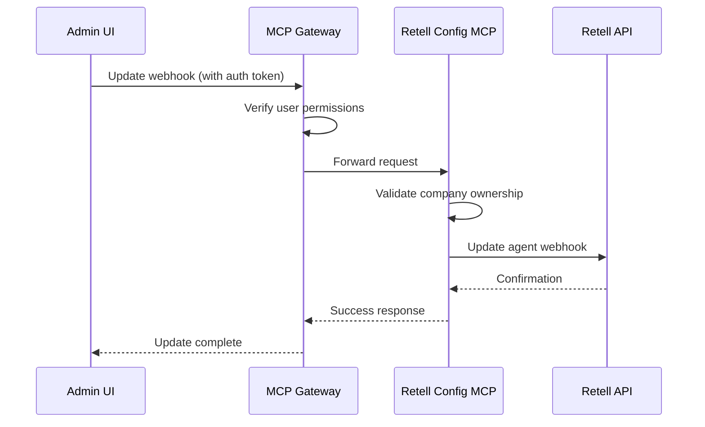

# Retell Webhook Configuration

!!! success "New Feature"
    The Retell Webhook Configuration interface allows direct management of Retell.ai webhooks and custom functions from within the AskProAI admin panel, eliminating the need to access the Retell.ai dashboard.

## 🎯 Overview

The Retell Webhook Configuration page (`/admin/retell-webhook-configuration`) provides a comprehensive interface for managing all aspects of Retell.ai integration:

- Webhook URL configuration
- Custom function deployment
- Agent prompt management
- Real-time testing tools
- Configuration synchronization

## 🚀 Key Features

### 1. Webhook Management

Configure webhook endpoints directly from the UI:

```yaml
Webhook URL: https://api.askproai.de/api/mcp/retell/custom-function
Supported Events:
  - call_started
  - call_ended
  - call_analyzed
```

### 2. Custom Function Editor

Built-in editor for Retell.ai custom functions with syntax highlighting:

```javascript
// Example custom function
{
  "name": "collect_appointment_information",
  "description": "Collects appointment booking details",
  "parameters": {
    "type": "object",
    "properties": {
      "name": { "type": "string", "description": "Customer name" },
      "date": { "type": "string", "description": "Appointment date" },
      "time": { "type": "string", "description": "Appointment time" },
      "service": { "type": "string", "description": "Service requested" }
    },
    "required": ["name", "date", "time"]
  }
}
```

### 3. Agent Configuration

Update agent prompts and settings without leaving AskProAI:

- System prompts
- Greeting messages
- Voice settings
- Language preferences
- Custom instructions

### 4. Testing Tools

Comprehensive testing interface:

- **Webhook Tester**: Send test webhooks to verify configuration
- **Function Simulator**: Test custom functions with sample data
- **Call Simulator**: Simulate entire call flows
- **Debug Console**: View real-time logs and responses

## 📋 User Interface

### Main Dashboard

```
┌─────────────────────────────────────────────────────────────┐
│ Retell Webhook Configuration                           ⚙️ 🔄  │
├─────────────────────────────────────────────────────────────┤
│                                                             │
│ Company: AskProAI Demo Company                              │
│ Status: ● Connected                                         │
│                                                             │
│ ┌─────────────────────┐ ┌─────────────────────┐           │
│ │ Webhook Settings    │ │ Custom Functions    │           │
│ ├─────────────────────┤ ├─────────────────────┤           │
│ │ URL: ✓ Configured   │ │ Deployed: 3         │           │
│ │ Events: 3 active    │ │ Last sync: 2 min    │           │
│ │ [Configure]         │ │ [Manage]            │           │
│ └─────────────────────┘ └─────────────────────┘           │
│                                                             │
│ ┌─────────────────────────────────────────────┐           │
│ │ Agents (2)                                   │           │
│ ├─────────────────────────────────────────────┤           │
│ │ ▶ Main Reception Agent                       │           │
│ │   ID: agent_abc123                           │           │
│ │   Phone: +49 30 837 93 369                   │           │
│ │   [Edit Prompt] [Test] [Deploy Functions]    │           │
│ │                                               │           │
│ │ ▶ Backup Agent                               │           │
│ │   ID: agent_xyz789                           │           │
│ │   Phone: +49 30 837 93 370                   │           │
│ │   [Edit Prompt] [Test] [Deploy Functions]    │           │
│ └─────────────────────────────────────────────┘           │
│                                                             │
│ [Test Webhook] [Sync All] [View Logs]                      │
└─────────────────────────────────────────────────────────────┘
```

### Webhook Configuration Modal

```
┌─────────────────────────────────────────────────────────────┐
│ Configure Webhook                                      X    │
├─────────────────────────────────────────────────────────────┤
│                                                             │
│ Webhook URL:                                                │
│ ┌─────────────────────────────────────────────────────┐   │
│ │ https://api.askproai.de/api/mcp/retell/custom-func │   │
│ └─────────────────────────────────────────────────────┘   │
│                                                             │
│ Events to Subscribe:                                        │
│ ☑ call_started    - Triggered when call begins             │
│ ☑ call_ended      - Triggered when call completes          │
│ ☑ call_analyzed   - Triggered after call analysis          │
│ ☐ call_transferred - Triggered on call transfer            │
│                                                             │
│ Authentication:                                             │
│ ┌─────────────────────────────────────────────────────┐   │
│ │ Secret: ••••••••••••••••••••••                     │   │
│ └─────────────────────────────────────────────────────┘   │
│                                                             │
│ Apply to Agents:                                            │
│ ☑ All agents in company                                     │
│ ☐ Selected agents only                                      │
│                                                             │
│ [Cancel]                              [Test] [Save & Deploy] │
└─────────────────────────────────────────────────────────────┘
```

## 🔧 Implementation Details

### MCP Server Integration

All operations go through the MCP Gateway:

```php
// Frontend makes JSON-RPC call
POST /api/mcp/gateway
{
    "jsonrpc": "2.0",
    "method": "retell_config.updateWebhook",
    "params": {
        "company_id": 1,
        "webhook_url": "https://api.askproai.de/api/mcp/retell/custom-function",
        "events": ["call_started", "call_ended", "call_analyzed"],
        "agent_ids": ["agent_abc123", "agent_xyz789"]
    },
    "id": "req_123"
}

// MCP Server handles the update
$result = $retellConfigMCP->updateWebhook($params);
```

### Custom Function Deployment

```php
// Deploy custom functions to agents
$functions = [
    'collect_appointment_information' => [...],
    'change_appointment_details' => [...],
    'cancel_appointment' => [...]
];

$result = $retellConfigMCP->deployCustomFunctions([
    'company_id' => 1,
    'agent_ids' => ['agent_abc123'],
    'functions' => $functions
]);
```

### Testing Workflow

1. **Configure Webhook**: Set URL and events
2. **Deploy Functions**: Push custom functions to agents
3. **Test Webhook**: Send test payload
4. **Verify Response**: Check logs and responses
5. **Make Test Call**: Verify end-to-end flow

## 📊 Monitoring & Debugging

### Real-time Logs

View webhook activity in real-time:

```
[2025-06-23 14:32:15] Webhook received: call_ended
[2025-06-23 14:32:15] Signature verified ✓
[2025-06-23 14:32:15] Call ID: call_abc123
[2025-06-23 14:32:16] Custom function data found ✓
[2025-06-23 14:32:16] Creating appointment...
[2025-06-23 14:32:17] Appointment created: #12345 ✓
[2025-06-23 14:32:17] Webhook processed successfully
```

### Debug Information

Access detailed debug information:

- Request/response payloads
- Timing information
- Error traces
- Cache contents
- Circuit breaker status

## 🔒 Security

### Authentication Flow



### Security Features

- **Multi-tenancy**: Company-scoped access only
- **Permission Checks**: Role-based access control
- **Signature Verification**: HMAC-SHA256 validation
- **Audit Logging**: All configuration changes logged
- **Encrypted Storage**: API keys encrypted at rest

## 🚀 Best Practices

1. **Always Test First**: Use the test webhook feature before deploying
2. **Monitor Logs**: Check logs after configuration changes
3. **Sync Regularly**: Keep local config in sync with Retell
4. **Document Prompts**: Keep a changelog of prompt modifications
5. **Backup Functions**: Export custom functions before changes

## 📝 Troubleshooting

### Common Issues

1. **Webhook Not Receiving Calls**
   - Verify webhook URL is publicly accessible
   - Check signature secret matches
   - Ensure events are subscribed
   - Test with webhook tester

2. **Custom Functions Not Working**
   - Verify function syntax
   - Check required parameters
   - Test with function simulator
   - Review agent logs

3. **Configuration Not Syncing**
   - Check API key validity
   - Verify network connectivity
   - Review error logs
   - Try manual sync

### Debug Commands

```bash
# Test webhook endpoint
curl -X POST https://api.askproai.de/api/mcp/retell/custom-function \
  -H "Content-Type: application/json" \
  -H "x-retell-signature: test_signature" \
  -d '{"event": "test", "call_id": "test_123"}'

# Check MCP server status
php artisan mcp:status retell_config

# View recent webhook logs
tail -f storage/logs/webhooks.log | grep retell

# Debug cache contents
php artisan tinker
>>> Cache::get('retell:appointment:call_123')
```

## 🎯 Future Enhancements

- [ ] Webhook replay functionality
- [ ] A/B testing for prompts
- [ ] Visual flow builder for custom functions
- [ ] Webhook performance analytics
- [ ] Automated testing suite
- [ ] Prompt versioning system

---

!!! tip "Pro Tip"
    Use the "Sync All" button after major Retell.ai updates to ensure your local configuration matches the remote state.