# Welcome to AskProAI Documentation

!!! success "Production Ready"
    The system is **85% production ready** with only 2 configurations needed to go live!

## 🚀 What is AskProAI?

AskProAI is an **AI-powered SaaS platform** that automatically answers incoming customer calls and independently schedules appointments. Through the integration of phone AI (Retell.ai) and online calendar system (Cal.com), it creates a seamless end-to-end solution for appointment bookings.

### Key Metrics
| Metric | Value | Status |
|--------|-------|--------|
| Success Rate | 99.3% | ✅ Excellent |
| Avg Response Time | 187ms | ✅ Fast |
| Production Ready | 85% | ⚡ Almost there |
| MCP Servers | 5 | ✅ Operational |
| Database Tables | 119 → 25 | 🔧 Needs consolidation |

## 🎯 Core Features

<div class="grid cards" markdown>

- :material-phone-in-talk: **24/7 AI Phone Answering**
    
    Never miss a call again. Our AI agents answer professionally in German and 30+ languages.

- :material-calendar-check: **Automatic Appointment Booking**
    
    Seamlessly books appointments directly into Cal.com calendars during phone conversations.

- :material-office-building: **Multi-Tenant Architecture**
    
    Supports multiple businesses with complete data isolation and customization.

- :material-brain: **Advanced MCP Integration**
    
    5 specialized MCP servers orchestrate the entire booking process with 99.3% reliability.

- :material-shield-check: **GDPR Compliant**
    
    Full GDPR/DSGVO compliance with data export, deletion, and encryption features.

- :material-chart-line: **Analytics & ROI Tracking**
    
    Comprehensive analytics dashboard with ROI calculation and performance metrics.

</div>

## 📊 System Architecture Overview

```mermaid
graph TB
    subgraph "Customer Interface"
        PHONE[📞 Phone Call]
        WEB[💻 Web Portal]
        WHATSAPP[📱 WhatsApp]
    end
    
    subgraph "AI Layer"
        RETELL[Retell.ai Agent]
        MCP[MCP Orchestrator]
    end
    
    subgraph "Business Logic"
        BOOKING[Booking Service]
        CUSTOMER[Customer Service]
        CALENDAR[Calendar Service]
    end
    
    subgraph "External Services"
        CALCOM[Cal.com]
        STRIPE[Stripe]
        SMS[SMS Gateway]
    end
    
    subgraph "Data Layer"
        DB[(MySQL)]
        REDIS[(Redis)]
    end
    
    PHONE --> RETELL
    RETELL --> MCP
    MCP --> BOOKING
    BOOKING --> CALENDAR
    CALENDAR --> CALCOM
    BOOKING --> CUSTOMER
    CUSTOMER --> DB
    MCP --> REDIS
    BOOKING --> STRIPE
    WHATSAPP -.->|Coming Soon| MCP
    WEB --> CUSTOMER
```



## 🔥 Quick Start

!!! tip "Only 2 Configurations Needed!"
    1. Set `branches.calcom_event_type_id` 
    2. Set `phone_numbers.retell_agent_id`
    
    That's it! The system handles everything else automatically.

### Minimal Setup Steps

1. **Clone the repository**
    ```bash
    git clone https://github.com/askproai/api-gateway.git
    cd api-gateway
    ```

2. **Install dependencies**
    ```bash
    composer install
    npm install
    ```

3. **Configure environment**
    ```bash
    cp .env.example .env
    php artisan key:generate
    ```

4. **Run migrations**
    ```bash
    php artisan migrate --seed
    ```

5. **Configure the 2 critical values**
    ```sql
    -- Set Cal.com Event Type
    UPDATE branches SET calcom_event_type_id = YOUR_EVENT_TYPE_ID WHERE id = 1;
    
    -- Set Retell Agent
    UPDATE phone_numbers SET retell_agent_id = 'YOUR_AGENT_ID' WHERE number = '+YOUR_PHONE';
    ```

6. **Start the services**
    ```bash
    php artisan serve
    php artisan horizon
    npm run dev
    ```

## 🚨 Critical Security Notes

!!! danger "Immediate Action Required"
    The following security issues were discovered during analysis:
    
    - **Remove all debug routes** from production
    - **Remove webhook bypass middleware** 
    - **Secure metrics endpoints** with authentication
    - **Remove hardcoded credentials** from routes/web.php

See [Security Audit](operations/security-audit.md) for details.

## 📚 Documentation Sections

### For Developers
- [System Architecture](architecture/overview.md) - Understand the system design
- [API Reference](api/rest-v2.md) - Complete API documentation
- [Development Setup](development/setup.md) - Get started with development

### For Operations
- [Deployment Guide](deployment/production.md) - Deploy to production
- [Monitoring](operations/monitoring.md) - Monitor system health
- [Troubleshooting](operations/troubleshooting.md) - Fix common issues

### For Business Users
- [Feature Overview](features/appointment-booking.md) - What AskProAI can do
- [ROI Calculator](features/analytics.md) - Calculate your return on investment
- [GDPR Compliance](features/gdpr.md) - Data protection features

## 🎉 Hidden Features Discovered

During our exhaustive analysis, we found several powerful features that were not documented:

- **Knowledge Base System** - AI-powered documentation with markdown enhancement
- **WhatsApp Integration** - Ready but not activated
- **Customer Self-Service Portal** - Partially implemented
- **Advanced Analytics** - Quantum monitoring dashboard
- **Mobile App API** - Endpoints ready for mobile apps

## 📈 Project Status

### What's Working Great ✅
- Core booking flow (99.3% success rate)
- MCP orchestration system
- Multi-tenant architecture
- Stripe billing integration
- GDPR compliance features

### What Needs Work 🔧
- Database consolidation (119 → 25 tables)
- Service layer cleanup (12 → 3 services)
- Security hardening
- Documentation updates
- Test coverage improvement

## 🤝 Getting Help

- **GitHub Issues**: [Report bugs or request features](https://github.com/askproai/api-gateway/issues)
- **Documentation**: You're reading it!
- **API Status**: Check [System Status](status.md)

---

*Last updated: {date}*