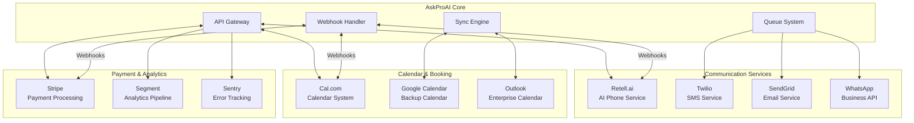

# Integrations Overview

## Introduction

AskProAI integrates with multiple best-in-class services to provide a comprehensive appointment booking solution. Each integration is carefully selected and implemented to ensure reliability, scalability, and seamless user experience.

## Integration Architecture



## Core Integrations

### 1. Retell.ai - AI Phone Service

**Purpose**: Natural language phone conversations and appointment booking

**Key Features**:
- 30+ language support
- Natural conversation flow
- Real-time transcription
- Sentiment analysis
- Custom AI agents

**Integration Points**:
- Webhook for call events
- API for agent management
- Real-time call monitoring
- Recording storage

### 2. Cal.com - Calendar Management

**Purpose**: Professional scheduling and availability management

**Key Features**:
- Multi-calendar support
- Team scheduling
- Buffer time management
- Timezone handling
- Recurring appointments

**Integration Points**:
- REST API v2
- Webhook notifications
- Real-time availability
- Booking management

### 3. Stripe - Payment Processing

**Purpose**: Secure payment collection and subscription management

**Key Features**:
- PCI compliant payments
- Subscription billing
- Invoice generation
- Payment methods
- Refund handling

**Integration Points**:
- Payment intents
- Webhook events
- Customer portal
- Billing dashboard

## Communication Integrations

### 4. Twilio - SMS Service

**Purpose**: Appointment confirmations and reminders via SMS

**Key Features**:
- Global SMS delivery
- Delivery receipts
- Two-way messaging
- Short codes
- Number pooling

### 5. SendGrid - Email Service

**Purpose**: Transactional emails and notifications

**Key Features**:
- Template management
- Delivery tracking
- Bounce handling
- Spam compliance
- Analytics

### 6. WhatsApp Business API

**Purpose**: Rich messaging and customer communication

**Key Features**:
- Media messages
- Message templates
- Two-way chat
- Business profile
- Quick replies

## Analytics & Monitoring

### 7. Sentry - Error Tracking

**Purpose**: Real-time error monitoring and debugging

**Key Features**:
- Error aggregation
- Performance monitoring
- Release tracking
- User feedback
- Alert rules

### 8. Segment - Analytics Pipeline

**Purpose**: Unified customer data and analytics

**Key Features**:
- Event tracking
- User profiles
- Data warehousing
- Integration hub
- GDPR compliance

## Integration Patterns

### 1. Webhook Processing

```php
class WebhookProcessor
{
    protected array $handlers = [
        'retell' => RetellWebhookHandler::class,
        'calcom' => CalcomWebhookHandler::class,
        'stripe' => StripeWebhookHandler::class,
    ];
    
    public function process(string $source, Request $request)
    {
        // Verify signature
        if (!$this->verifySignature($source, $request)) {
            throw new InvalidSignatureException();
        }
        
        // Get handler
        $handler = app($this->handlers[$source]);
        
        // Process webhook
        return $handler->handle($request->all());
    }
}
```

### 2. API Client Pattern

```php
abstract class BaseApiClient
{
    protected string $baseUrl;
    protected array $headers;
    protected CircuitBreaker $circuitBreaker;
    
    public function request(string $method, string $path, array $data = [])
    {
        return $this->circuitBreaker->call(function () use ($method, $path, $data) {
            $response = Http::withHeaders($this->headers)
                ->timeout(30)
                ->{$method}($this->baseUrl . $path, $data);
                
            if (!$response->successful()) {
                throw new ApiException($response->body(), $response->status());
            }
            
            return $response->json();
        });
    }
}
```

### 3. Sync Engine

```php
class SyncEngine
{
    public function sync(string $integration, int $companyId)
    {
        $syncer = $this->getSyncer($integration);
        
        DB::transaction(function () use ($syncer, $companyId) {
            // Get last sync point
            $lastSync = SyncLog::where('integration', $integration)
                ->where('company_id', $companyId)
                ->latest()
                ->first();
            
            // Perform sync
            $result = $syncer->sync($companyId, $lastSync?->synced_at);
            
            // Log results
            SyncLog::create([
                'integration' => $integration,
                'company_id' => $companyId,
                'records_synced' => $result->count,
                'status' => $result->status,
                'synced_at' => now(),
            ]);
        });
    }
}
```

## Security & Compliance

### API Key Management

```php
class IntegrationCredentials
{
    protected function getCredential(string $integration, string $key, ?int $companyId = null)
    {
        // Company-specific credential
        if ($companyId) {
            $credential = CompanyIntegration::where('company_id', $companyId)
                ->where('integration', $integration)
                ->value($key);
                
            if ($credential) {
                return Crypt::decryptString($credential);
            }
        }
        
        // Fall back to default
        return config("services.{$integration}.{$key}");
    }
}
```

### Webhook Security

```php
trait VerifiesWebhookSignature
{
    protected function verifySignature(Request $request, string $secret): bool
    {
        $payload = $request->getContent();
        $signature = $request->header($this->getSignatureHeader());
        
        $expected = $this->calculateSignature($payload, $secret);
        
        return hash_equals($expected, $signature);
    }
    
    abstract protected function getSignatureHeader(): string;
    abstract protected function calculateSignature(string $payload, string $secret): string;
}
```

## Monitoring & Health Checks

### Integration Health

```php
class IntegrationHealthCheck
{
    public function checkAll(): array
    {
        return collect($this->integrations)->map(function ($integration) {
            return [
                'name' => $integration,
                'status' => $this->check($integration),
                'latency' => $this->measureLatency($integration),
                'last_error' => $this->getLastError($integration),
            ];
        })->toArray();
    }
    
    protected function check(string $integration): string
    {
        try {
            $checker = app("App\\Services\\{$integration}\\HealthCheck");
            return $checker->check() ? 'healthy' : 'unhealthy';
        } catch (\Exception $e) {
            return 'error';
        }
    }
}
```

### Circuit Breaker

```php
class CircuitBreaker
{
    protected array $config = [
        'failure_threshold' => 5,
        'success_threshold' => 2,
        'timeout' => 60,
        'half_open_max_attempts' => 3,
    ];
    
    public function call(Closure $callback)
    {
        $state = $this->getState();
        
        if ($state === 'open') {
            if ($this->shouldAttemptReset()) {
                $state = 'half-open';
            } else {
                throw new CircuitOpenException();
            }
        }
        
        try {
            $result = $callback();
            $this->recordSuccess();
            return $result;
        } catch (\Exception $e) {
            $this->recordFailure();
            throw $e;
        }
    }
}
```

## Rate Limiting

### Per-Integration Limits

```yaml
Retell.ai:
  requests_per_minute: 60
  requests_per_hour: 1000
  concurrent_calls: 50

Cal.com:
  requests_per_minute: 100
  requests_per_hour: 5000
  concurrent_requests: 20

Stripe:
  requests_per_minute: 100
  requests_per_hour: 10000
  concurrent_requests: 25
```

## Best Practices

### 1. Error Handling

```php
try {
    $result = $integration->call();
} catch (RateLimitException $e) {
    // Retry with backoff
    return $this->retryWithBackoff($e->getRetryAfter());
} catch (ApiException $e) {
    // Log and fallback
    Log::error('Integration failed', ['error' => $e]);
    return $this->fallbackBehavior();
} catch (NetworkException $e) {
    // Circuit breaker
    $this->circuitBreaker->recordFailure();
    throw $e;
}
```

### 2. Data Synchronization

- Use webhooks for real-time updates
- Implement periodic sync for consistency
- Handle conflicts gracefully
- Maintain sync logs
- Support manual re-sync

### 3. Testing

```php
class IntegrationTest extends TestCase
{
    public function test_integration_handles_errors()
    {
        Http::fake([
            'api.service.com/*' => Http::response([], 500),
        ]);
        
        $this->expectException(ApiException::class);
        
        $integration = new ServiceIntegration();
        $integration->fetchData();
    }
}
```

## Adding New Integrations

### Integration Checklist

- [ ] Create service class implementing `IntegrationInterface`
- [ ] Add configuration to `config/services.php`
- [ ] Implement webhook handler if needed
- [ ] Add health check endpoint
- [ ] Create queue jobs for async operations
- [ ] Add circuit breaker configuration
- [ ] Write integration tests
- [ ] Document API endpoints and webhooks
- [ ] Add monitoring metrics
- [ ] Create admin UI for configuration

### Example Integration

```php
class NewServiceIntegration implements IntegrationInterface
{
    use MakesHttpRequests, VerifiesWebhookSignature;
    
    protected string $apiKey;
    protected string $baseUrl;
    
    public function __construct()
    {
        $this->apiKey = config('services.newservice.api_key');
        $this->baseUrl = config('services.newservice.base_url');
    }
    
    public function connect(): bool
    {
        try {
            $response = $this->get('/health');
            return $response['status'] === 'ok';
        } catch (\Exception $e) {
            return false;
        }
    }
    
    public function sync(int $companyId, ?Carbon $since = null): SyncResult
    {
        // Implementation
    }
    
    public function handleWebhook(array $payload): void
    {
        // Implementation
    }
}
```