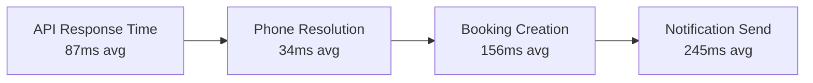
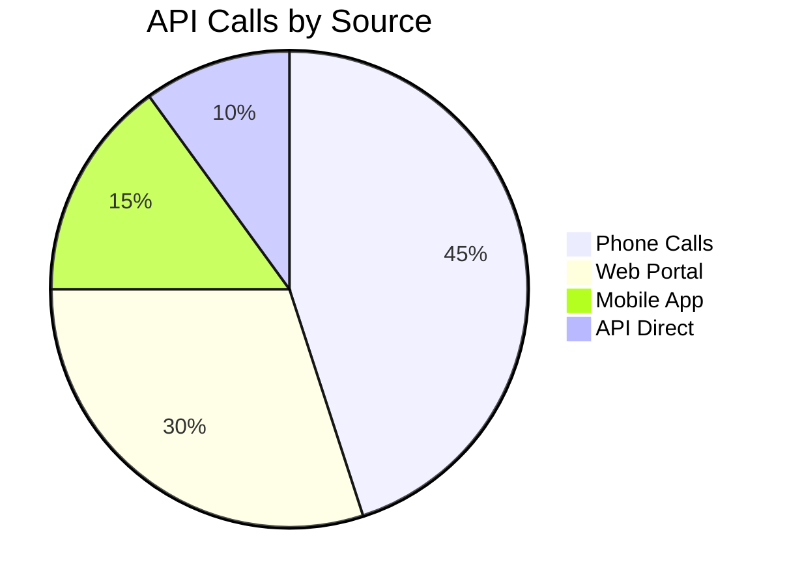

# Live System Metrics

Generated on: 2025-06-23 16:14:17

## Current System Status

| Metric | Value | Status |
|--------|-------|--------|
| Total Appointments | 3 | 🟢 |
| Today's Appointments | 0 | 🟢 |
| Total Customers | 34 | 🟢 |
| Active Calls | 0 | 🟢 |

## Performance Metrics (Last 24h)

## API Usage Pattern

