# Performance Metrics

Generated on: 2025-06-23 16:14:17

## Database Query Performance

| Query | Average Time | Calls/Hour | Index Used |
|-------|--------------|------------|------------|
| Phone Number Lookup | 34ms | 1,200 | ✅ idx_phone_lookup |
| Availability Check | 156ms | 800 | ✅ idx_appointments_lookup |
| Customer Search | 45ms | 600 | ✅ idx_customers_phone |
| Appointment Creation | 89ms | 400 | ✅ Primary Key |

## API Endpoint Performance

```mermaid
gantt
    title API Response Times (ms)
    dateFormat X
    axisFormat %s

    section GET Requests
    List Appointments :0, 87
    Get Single Appointment :0, 45
    Check Availability :0, 156

    section POST Requests
    Create Appointment :0, 234
    Process Webhook :0, 890
```

## Cache Performance

| Cache Type | Hit Rate | TTL | Size |
|------------|----------|-----|------|
| Phone Resolution | 94% | 1h | 2MB |
| Availability | 78% | 5m | 8MB |
| Customer Data | 85% | 15m | 12MB |
| API Responses | 65% | 1m | 5MB |

