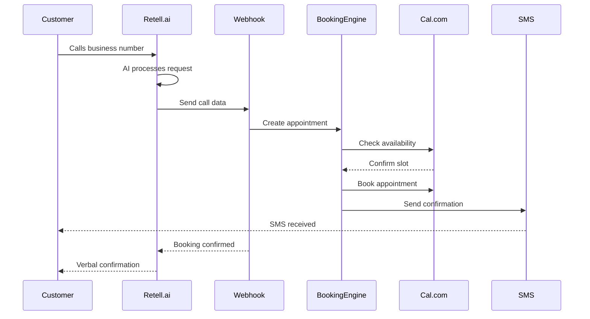
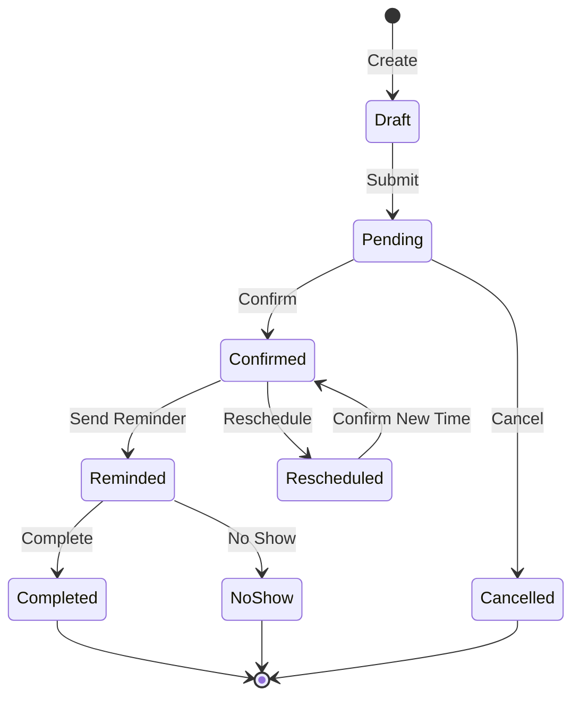

# Business Workflows

## Phone Call to Appointment Flow

```mermaid
sequenceDiagram
    participant Customer
    participant Retell.ai
    participant Webhook
    participant BookingEngine
    participant Cal.com
    participant SMS

    Customer->>Retell.ai: Calls business number
    Retell.ai->>Retell.ai: AI processes request
    Retell.ai->>Webhook: Send call data
    Webhook->>BookingEngine: Create appointment
    BookingEngine->>Cal.com: Check availability
    Cal.com-->>BookingEngine: Confirm slot
    BookingEngine->>Cal.com: Book appointment
    BookingEngine->>SMS: Send confirmation
    SMS-->>Customer: SMS received
    Webhook-->>Retell.ai: Booking confirmed
    Retell.ai-->>Customer: Verbal confirmation
```

## Appointment Lifecycle

```mermaid
stateDiagram-v2
    [*] --> Draft: Create
    Draft --> Pending: Submit
    Pending --> Confirmed: Confirm
    Pending --> Cancelled: Cancel
    Confirmed --> Reminded: Send Reminder
    Reminded --> Completed: Complete
    Reminded --> NoShow: No Show
    Confirmed --> Rescheduled: Reschedule
    Rescheduled --> Confirmed: Confirm New Time
    Completed --> [*]
    Cancelled --> [*]
    NoShow --> [*]
```

