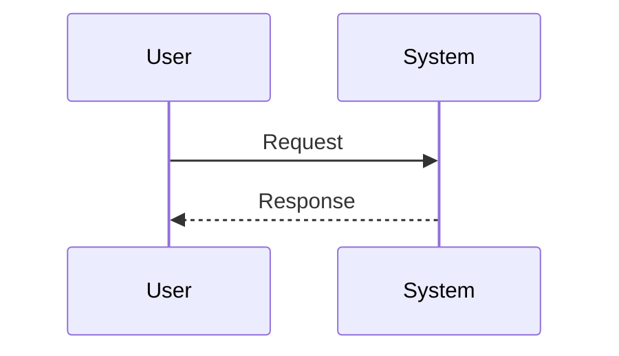
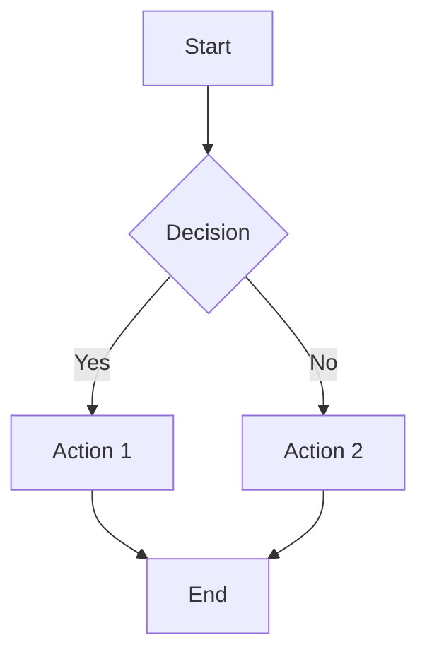
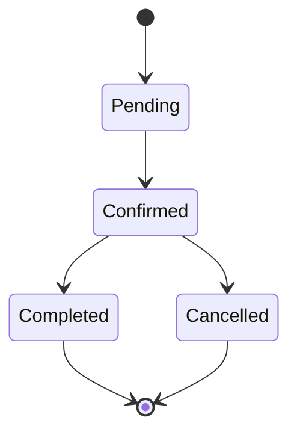

# Voice AI Agent Documentation System

## Overview

This is a comprehensive, interactive HTML documentation system for Voice AI Agent functions. It provides:

- **Feature Matrix** - Complete status tracking for all functions
- **Interactive Testing** - Test every function with real API calls
- **Data Flow Visualization** - Mermaid diagrams showing complete system architecture
- **Complete Specifications** - Parameter details, validation rules, error handling
- **Example Library** - Copy-paste examples for every function
- **Export Functionality** - JSON export for automation

## File Structure

```
/var/www/api-gateway/public/docs/voice-agent/
├── index.html              # Main documentation (single-page app)
├── README.md              # This file
└── assets/                # (Optional) Additional resources
    ├── examples/          # Example payloads
    └── schemas/           # JSON schemas
```

## Features

### 1. Feature Matrix Table

**Location**: Navigation → Feature Matrix

Tracks all system features with:
- Implementation status (Implemented/Partial/Missing)
- Priority level (Critical/High/Medium/Low)
- Specification completeness
- Test status
- Direct links to documentation

**Usage**:
- Get overview of system completeness
- Identify missing implementations
- Track testing progress
- Export for project management

### 2. Interactive Testing UI

**Location**: Each function page → "Interactive Test" tab

Features:
- Form builder with all function parameters
- Type validation and hints
- Real API calls to backend
- Formatted JSON response display
- Success/error indicators
- Copy as cURL functionality
- Response copying

**Usage**:
```javascript
// Form automatically builds request:
{
  "call_id": "test-call-123",
  "service_name": "Herrenhaarschnitt",
  "customer_phone": "+4915123456789"
}

// Makes real API call:
POST /api/retell/collect-appointment-info

// Displays formatted response with status code
```

### 3. Data Flow Visualization

**Location**: Each function page → "Data Flow" tab

Provides:
- Sequence diagrams (Retell → Backend → Cal.com)
- Request/response flow
- Error handling flows
- Database operations
- Cache interactions

**Technology**: Mermaid.js (renders in browser, no external dependencies)

### 4. Complete Documentation

**Location**: Each function page → "Documentation" tab

Includes:
- Function purpose and behavior
- Endpoint URL and HTTP method
- Complete parameter table with types, requirements, descriptions
- Validation rules
- Response schema
- Error codes and meanings
- Business logic explanation

### 5. Example Library

**Location**: Each function page → "Examples" tab

Provides:
- Minimal required fields example
- Complete fields example
- Error case examples
- cURL commands (copy-paste ready)
- Expected responses for each scenario

## Architecture

### Single-Page Application (SPA)

```
Header
  ├─ Logo
  ├─ Export Documentation button
  └─ Run All Tests button

Sidebar Navigation
  ├─ Overview
  │   ├─ Dashboard
  │   ├─ Feature Matrix
  │   └─ Architecture
  ├─ Functions (dynamic)
  │   ├─ collect_appointment_info
  │   ├─ check_availability
  │   └─ ...
  ├─ API Reference
  │   ├─ Webhooks
  │   ├─ Endpoints
  │   └─ Schemas
  └─ Testing
      ├─ Interactive Playground
      └─ Test Scenarios

Main Content Area
  └─ Active Section
      └─ Tabs (Documentation, Test, Examples, Flow)
```

### Navigation System

```javascript
// URL-based navigation with hash routing
function navigate(sectionId) {
  // Hide all sections
  // Show selected section
  // Update URL hash
  // Update active nav link
}

// On page load, handle hash
window.location.hash → navigate to section
```

### Tab System

```javascript
// Per-section tabs for organizing content
function switchTab(tabId) {
  // Hide all tabs in section
  // Show selected tab
  // Update active tab styling
}
```

### API Integration

```javascript
// Real API calls from testing forms
async function testFunction(event) {
  event.preventDefault();

  // Collect form data
  const data = collectFormData(form);

  // Make API call
  const response = await fetch(endpoint, {
    method: 'POST',
    headers: { 'Content-Type': 'application/json' },
    body: JSON.stringify(data)
  });

  // Display formatted response
  displayResponse(await response.json());
}
```

## Adding New Functions

### Step 1: Add to Feature Matrix

Edit the Feature Matrix section:

```html
<tr>
    <td><strong>new_function_name</strong></td>
    <td><span class="badge badge-success">Implemented</span></td>
    <td><span class="badge badge-critical">Critical</span></td>
    <td><span class="badge badge-success">Complete</span></td>
    <td><span class="badge badge-success">Pass</span></td>
    <td><a href="#new-function">View Docs</a></td>
</tr>
```

### Step 2: Add Navigation Link

Add to sidebar navigation:

```html
<div class="nav-section">
    <div class="nav-title">Functions</div>
    <a href="#new-function" class="nav-link" onclick="navigate('new-function')">
        new_function_name
    </a>
</div>
```

### Step 3: Create Function Section

Copy the `collect-appointment` section template:

```html
<section id="new-function" class="section">
    <div class="page-header">
        <h1 class="page-title">new_function_name</h1>
        <p class="page-description">Brief description</p>
    </div>

    <div class="tabs">
        <div class="tab active" onclick="switchTab('new-docs')">Documentation</div>
        <div class="tab" onclick="switchTab('new-test')">Interactive Test</div>
        <div class="tab" onclick="switchTab('new-examples')">Examples</div>
        <div class="tab" onclick="switchTab('new-flow')">Data Flow</div>
    </div>

    <!-- Tab content sections -->
</section>
```

### Step 4: Add Parameter Table

```html
<table class="param-table">
    <thead>
        <tr>
            <th>Parameter</th>
            <th>Type</th>
            <th>Required</th>
            <th>Description</th>
        </tr>
    </thead>
    <tbody>
        <tr>
            <td><code>param_name</code></td>
            <td><span class="param-type">string</span></td>
            <td><span class="badge badge-danger">Yes</span></td>
            <td>Parameter description</td>
        </tr>
    </tbody>
</table>
```

### Step 5: Create Interactive Test Form

```html
<form id="new-function-form" onsubmit="testNewFunction(event)">
    <div class="form-group">
        <label class="form-label">Parameter Name <span class="required">*</span></label>
        <input type="text" class="form-input" name="param_name" required>
        <div class="form-hint">Helpful hint</div>
    </div>

    <button type="submit" class="btn btn-primary" style="width: 100%;">
        Test Function Call
    </button>
</form>

<div id="new-response" class="response-container">
    <!-- Response display -->
</div>
```

### Step 6: Add JavaScript Handler

```javascript
async function testNewFunction(event) {
    event.preventDefault();

    const form = event.target;
    const formData = new FormData(form);
    const data = Object.fromEntries(formData.entries());

    const responseContainer = document.getElementById('new-response');
    const responseBody = document.getElementById('new-response-body');

    responseContainer.classList.add('show');
    responseBody.innerHTML = '<div class="loading"></div> Testing...';

    try {
        const response = await fetch('/api/your-endpoint', {
            method: 'POST',
            headers: {
                'Content-Type': 'application/json',
                'Accept': 'application/json'
            },
            body: JSON.stringify(data)
        });

        const result = await response.json();
        responseBody.textContent = JSON.stringify(result, null, 2);

    } catch (error) {
        responseBody.textContent = JSON.stringify({
            success: false,
            message: error.message
        }, null, 2);
    }
}
```

### Step 7: Add Mermaid Diagram

```html
<div class="diagram-container">
    <pre class="mermaid">
sequenceDiagram
    participant A as Component A
    participant B as Component B

    A->>B: Request
    B-->>A: Response
    </pre>
</div>
```

## Styling System

### CSS Variables

```css
:root {
    --primary: #2563eb;           /* Primary blue */
    --success: #10b981;           /* Success green */
    --warning: #f59e0b;           /* Warning orange */
    --danger: #ef4444;            /* Error red */
    --gray-*: /* Gray scale */
}
```

### Component Classes

**Cards**:
```html
<div class="card">
    <div class="card-header">
        <h2 class="card-title">Title</h2>
    </div>
    <!-- Content -->
</div>
```

**Badges**:
```html
<span class="badge badge-success">Implemented</span>
<span class="badge badge-warning">Partial</span>
<span class="badge badge-danger">Missing</span>
<span class="badge badge-critical">Critical</span>
```

**Buttons**:
```html
<button class="btn btn-primary">Primary Action</button>
<button class="btn btn-secondary">Secondary Action</button>
```

**Forms**:
```html
<div class="form-group">
    <label class="form-label">Label <span class="required">*</span></label>
    <input type="text" class="form-input">
    <div class="form-hint">Helpful hint</div>
</div>
```

**Alerts**:
```html
<div class="alert alert-info">Info message</div>
<div class="alert alert-warning">Warning message</div>
<div class="alert alert-danger">Error message</div>
```

**Grid Layout**:
```html
<div class="grid grid-2">
    <div>Column 1</div>
    <div>Column 2</div>
</div>

<div class="grid grid-3">
    <div>Column 1</div>
    <div>Column 2</div>
    <div>Column 3</div>
</div>
```

## Mermaid Diagram Types

### Sequence Diagram



### Flow Diagram



### State Diagram



## Testing Features

### Interactive Testing

Each function has a dedicated testing form:

1. **Form Validation** - Client-side validation before API call
2. **Real API Calls** - Actual HTTP requests to backend
3. **Response Display** - Formatted JSON with syntax highlighting
4. **Status Indicators** - Visual success/error feedback
5. **Copy Functions** - Copy request, response, or cURL command

### Test Scenarios

Pre-defined test scenarios include:

- **Happy Path** - All required fields, successful flow
- **Minimal Fields** - Only required parameters
- **Validation Errors** - Invalid data formats
- **Business Logic Errors** - Valid format but business rule violations
- **Edge Cases** - Boundary conditions, special characters
- **Error Recovery** - System error handling

### Run All Tests

```javascript
async function runAllTests() {
    const functions = [
        'collect_appointment_info',
        'check_availability',
        'book_appointment'
    ];

    for (const func of functions) {
        await testFunction(func, testScenarios[func]);
    }

    generateTestReport();
}
```

## Export Functionality

### JSON Export

```javascript
function exportDocumentation() {
    const doc = {
        title: "Voice AI Agent Documentation",
        version: "1.0.0",
        generated: new Date().toISOString(),
        functions: extractFunctionSpecs(),
        schemas: extractSchemas(),
        testResults: getTestResults()
    };

    downloadJSON(doc, 'voice-agent-documentation.json');
}
```

### OpenAPI Export

Add OpenAPI/Swagger export:

```javascript
function exportOpenAPI() {
    const spec = {
        openapi: "3.0.0",
        info: {
            title: "Voice AI Agent API",
            version: "1.0.0"
        },
        paths: generatePaths(),
        components: {
            schemas: generateSchemas()
        }
    };

    downloadJSON(spec, 'openapi-spec.json');
}
```

## Maintenance

### Updating Documentation

1. **Function Changes** - Update parameter tables, validation rules
2. **New Examples** - Add to Examples tab
3. **Flow Changes** - Update Mermaid diagrams
4. **Test Updates** - Modify test forms and expected responses

### Performance Optimization

- **Lazy Loading** - Load diagrams only when tab is active
- **Code Splitting** - Separate JS for testing functionality
- **Caching** - Cache API responses for repeated tests
- **Minification** - Minify CSS/JS for production

### Browser Compatibility

Tested and working in:
- Chrome/Edge 90+
- Firefox 88+
- Safari 14+

Features used:
- CSS Grid
- Fetch API
- ES6+ JavaScript
- CSS Custom Properties

## Security Considerations

### API Calls

- All API calls require proper authentication
- CSRF tokens for state-changing operations
- Rate limiting on testing endpoints
- Input sanitization before sending

### Content Security

```html
<meta http-equiv="Content-Security-Policy"
      content="default-src 'self';
               script-src 'self' 'unsafe-inline' cdn.jsdelivr.net;
               style-src 'self' 'unsafe-inline';">
```

## Future Enhancements

### Phase 2 Features

1. **Authentication** - Login system for protected docs
2. **Version History** - Track documentation changes
3. **Search Functionality** - Full-text search across all docs
4. **Dark Mode** - Toggle between light/dark themes
5. **PDF Export** - Generate PDF documentation
6. **Collaborative Testing** - Share test sessions
7. **Performance Metrics** - Track API response times
8. **Automated Testing** - Integration with CI/CD

### Phase 3 Features

1. **API Mocking** - Mock responses for offline testing
2. **Code Generation** - Generate client SDKs
3. **Documentation as Code** - YAML/JSON source → HTML
4. **Multi-language Support** - i18n for global teams
5. **Webhook Testing** - Simulate incoming webhooks
6. **Load Testing** - Stress test functions
7. **Analytics Dashboard** - Usage statistics
8. **AI Assistant** - Natural language function lookup

## Usage Examples

### For Developers

```bash
# Open documentation
open /var/www/api-gateway/public/docs/voice-agent/index.html

# Test a function
1. Navigate to function page
2. Click "Interactive Test" tab
3. Fill form with test data
4. Click "Test Function Call"
5. Review response

# Export specifications
1. Click "Export JSON" in header
2. Save file for use in automation
```

### For QA Engineers

```bash
# Run test scenarios
1. Navigate to "Test Scenarios"
2. Select scenario
3. Click "Run Test"
4. Verify expected vs actual results

# Generate test report
1. Click "Run All Tests" in header
2. Wait for completion
3. Review summary
4. Export results
```

### For Technical Writers

```bash
# Update documentation
1. Edit index.html
2. Update parameter tables
3. Add new examples
4. Update Mermaid diagrams
5. Test all links
6. Commit changes
```

## Support

### Issues

Report issues at: [GitHub Issues](https://github.com/your-org/api-gateway/issues)

### Contributing

1. Fork repository
2. Create feature branch
3. Make changes
4. Test thoroughly
5. Submit pull request

## License

Copyright © 2025 AskPro AI. All rights reserved.

## Changelog

### Version 1.0.0 (2025-11-06)

- Initial release
- Feature matrix table
- Interactive testing UI for collect_appointment_info
- Complete data flow visualizations
- Example library with cURL commands
- JSON export functionality
- Responsive design
- Mermaid diagram integration