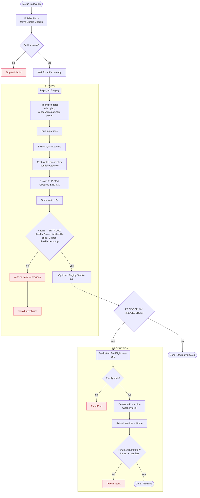

# E2E Deployment Flowchart

**Version:** 1.0
**Erstellt:** 2025-11-02
**Zweck:** Vollständiger Deployment-Flow von Build bis Production mit Gates

---

## Mermaid Flowchart

---

## Verwendung

Dieser Flowchart zeigt den vollständigen E2E-Deployment-Prozess:

### Phase 1: Build
- **Pre-Bundle Gates (Layer 1):** 9 kritische Checks vor Bundle-Erstellung
- **Artifact Upload:** 30 Tage Retention mit SHA256

### Phase 2: Staging Deployment
- **Pre-Switch Gates (Layer 2):** 9 Checks + PHP Tests VOR Migrations
- **Post-Switch Hardening:** Cache Clear + PHP-FPM Reload + Grace Period
- **Health Checks:** Retry-Logik (6 Attempts, 5s Intervall)
- **Auto-Rollback:** Bei Health-Failure

### Phase 3: Production (nach Freigabe)
- **Pre-Flight:** Read-only Validierung
- **Pre-Switch Gates (Layer 3):** 9 Checks + PHP Tests VOR Symlink
- **Zero-Downtime:** Atomic Symlink Switch (< 1s)
- **Auto-Rollback:** Bei Smoke-Test-Failure

---

## Abbruchkriterien

| Punkt | Aktion | Recovery |
|-------|--------|----------|
| Build Failure | Stop | Fix Code |
| Pre-Switch Gate Fail | Abort Deploy | Fix Bundle/Config |
| Health Check Fail | Auto-Rollback | Investigate Logs |
| Prod Pre-Flight Fail | NO-GO | Fix Staging First |

---

## Referenzen

- **Handbuch:** [DEPLOYMENT_HANDBUCH_FUER_DRITTE.html](https://api.askproai.de/docs/backup-system/DEPLOYMENT_HANDBUCH_FUER_DRITTE.html)
- **Status Quo:** [status-quo-deployment-prozess-2025-11-01.html](https://api.askproai.de/docs/backup-system/status-quo-deployment-prozess-2025-11-01.html)
- **E2E Validation:** [E2E_DEPLOYMENT_VALIDATION_FINAL_2025-11-02_1300.html](https://api.askproai.de/docs/backup-system/E2E_DEPLOYMENT_VALIDATION_FINAL_2025-11-02_1300.html)

---

**Wartung:** Bei Prozess-Änderungen dieses Flowchart aktualisieren.
