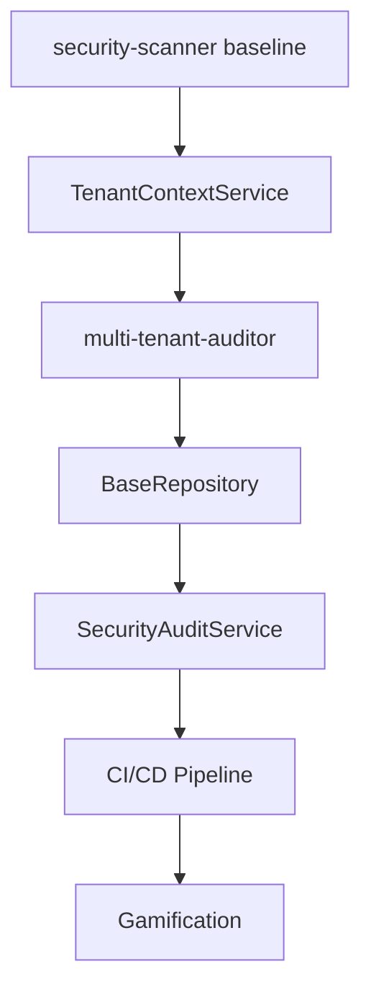

# 🏆 SECURITY SPRINT DAY 1 - CHAMPIONSHIP EXECUTION PLAN
## 8-Hour Security Fortress Building Session

> **TEAM MOTTO**: "We don't just fix vulnerabilities - we build enterprise-grade security!"
> 
> **TODAY'S MISSION**: Transform 400+ security issues into a fortress of protection while maintaining developer velocity and user experience.

---

## 🎯 **PARALLEL AGENT ORCHESTRATION MATRIX**

### **WAVE 1: Foundation & Quick Wins (Hours 1-2)**
*"Get the fundamentals bulletproof while momentum is high"*

| Agent | Task | Duration | Dependency | Output |
|-------|------|----------|------------|--------|
| **security-scanner** | Complete security audit baseline | 45min | None | Security findings report |
| **engineering/test-writer-fixer** | Setup security test infrastructure | 45min | None | Test framework ready |
| **performance-profiler** | Identify security-performance bottlenecks | 30min | security-scanner | Performance baseline |
| **studio-operations/infrastructure-maintainer** | Harden server-level security | 60min | None | Infrastructure secured |

**🔥 PARALLEL EXECUTION**: All agents work simultaneously on independent tasks!

### **WAVE 2: Critical Fixes (Hours 2.5-4.5)**
*"Fix the bleeding - stop active vulnerabilities NOW"*

| Agent | Task | Duration | Dependency | Quick Win Impact |
|-------|------|----------|------------|------------------|
| **security-scanner** | Fix CSRF token validation | 60min | Wave 1 complete | ✅ Immediate protection |
| **engineering/backend-architect** | Implement TenantContextService | 90min | security-scanner findings | ✅ Data isolation fixed |
| **multi-tenant-auditor** | Audit withoutGlobalScope usage | 45min | TenantContextService ready | ✅ Tenant security verified |
| **engineering/test-writer-fixer** | Create security regression tests | 60min | Critical fixes | ✅ Future-proof security |

**🚀 MILESTONE CHECKPOINT**: Review critical fixes, celebrate wins!

### **WAVE 3: Architecture & Automation (Hours 5-7)**
*"Build the fortress - systematic security by design"*

| Agent | Task | Duration | Dependency | Strategic Value |
|-------|------|----------|------------|-----------------|
| **engineering/backend-architect** | Implement BaseRepository pattern | 75min | Wave 2 complete | 🏰 Architecture foundation |
| **security-scanner** | Implement SecurityAuditService | 60min | BaseRepository | 🤖 Automated security |
| **engineering/devops-automator** | Setup security CI/CD pipeline | 45min | Security tests ready | 🔄 Continuous security |
| **testing/workflow-optimizer** | Optimize security testing workflow | 30min | CI/CD pipeline | ⚡ Developer velocity |

### **WAVE 4: Polish & Gamification (Hours 7-8)**
*"Make security delightful - because developers matter"*

| Agent | Task | Duration | Dependency | UX Impact |
|-------|------|----------|------------|-----------|
| **design/whimsy-injector** | Add security achievement system | 30min | Wave 3 complete | 🎮 Developer engagement |
| **design/ui-designer** | Design friendly security messages | 20min | SecurityAuditService | 😊 Better error UX |
| **project-management/project-shipper** | Prepare deployment checklist | 10min | All fixes ready | 🚢 Safe deployment |

---

## ⏰ **HOURLY CHECKPOINT SYSTEM**

### **Hour 1 Checkpoint - Foundation Check**
```bash
# Victory conditions:
✅ Security baseline established
✅ Test infrastructure ready  
✅ Server hardening in progress
✅ Performance baseline captured

# Coach review: "Are we building on solid ground?"
```

### **Hour 2.5 Checkpoint - Critical Path**
```bash
# Victory conditions:
✅ CSRF vulnerabilities identified
✅ TenantContextService architecture approved
✅ Infrastructure hardening complete
✅ Team coordination smooth

# Coach review: "Are we stopping the bleeding?"
```

### **Hour 4.5 Checkpoint - Major Wins**
```bash
# Victory conditions:
✅ CSRF protection implemented
✅ TenantContextService functional
✅ Multi-tenant audit complete (>80% coverage)
✅ Security regression tests passing

# Coach review: "Can we celebrate some major victories?"
```

### **Hour 7 Checkpoint - Architecture Victory**
```bash
# Victory conditions:
✅ BaseRepository pattern implemented
✅ SecurityAuditService operational
✅ CI/CD security pipeline active
✅ Developer workflow optimized

# Coach review: "Is our fortress built to last?"
```

### **Hour 8 Checkpoint - Sprint Champion**
```bash
# Victory conditions:
✅ Security achievements system active
✅ Friendly error messages deployed
✅ Deployment checklist approved
✅ Team ready for Day 2

# Coach review: "Are we ready to dominate Day 2?"
```

---

## 🔥 **QUICK WINS THAT BUILD MOMENTUM**

### **30-Minute Security Wins** (Immediate Impact)
1. **Re-enable rate limiting** with friendly error messages
2. **Fix CSRF token refresh** on session timeout
3. **Add security headers** to all responses
4. **Enable SQL injection protection** middleware
5. **Implement basic audit logging** for admin actions

### **60-Minute Architecture Wins** (Foundation Building)
1. **TenantContextService** - Stop data leaks permanently
2. **SecurityAuditService** - Automated vulnerability detection
3. **BaseRepository** - Secure data access patterns
4. **Security middleware stack** - Defense in depth
5. **Automated security testing** - Catch issues early

---

## 🤝 **AGENT COORDINATION PROTOCOLS**

### **Communication Channels**
- **Status Updates**: Every 30 minutes in task comments
- **Blocking Issues**: Immediate escalation to Coach
- **Handoffs**: Clear documentation of deliverables
- **Conflict Resolution**: Coach mediates resource conflicts

### **Dependency Management**


### **Parallel Work Streams**
- **Stream A**: Security fixes (security-scanner + backend-architect)
- **Stream B**: Testing infrastructure (test-writer-fixer + workflow-optimizer)  
- **Stream C**: Infrastructure (infrastructure-maintainer + devops-automator)
- **Stream D**: UX/Design (whimsy-injector + ui-designer)

---

## 🏅 **VICTORY CONDITIONS & CELEBRATION MOMENTS**

### **Micro-Celebrations** (Every 30 min)
- ✅ Each security test passes: "BOOM! Another vulnerability crushed!"
- ✅ Each middleware activated: "Defense layer ACTIVATED!"
- ✅ Each audit check complete: "Security checkpoint SECURED!"

### **Major Celebrations** (Hourly)
- 🎉 **Hour 2**: "Foundation is ROCK SOLID!"
- 🎉 **Hour 4**: "Critical vulnerabilities ELIMINATED!"
- 🎉 **Hour 6**: "Architecture fortress COMPLETE!"
- 🎉 **Hour 8**: "Day 1 CHAMPIONSHIP VICTORY!"

### **Team Momentum Boosters**
- Share security metrics improvements in real-time
- Highlight each agent's unique contributions
- Create mini-competitions between parallel streams
- Document "impossible problems solved" moments

---

## 🚨 **RISK MITIGATION & BACKUP PLANS**

### **If Rate Limiting Breaks Everything**
**Backup Plan**: Implement graceful degradation
- Agent: `engineering/backend-architect`
- Time: 30 minutes
- Fallback: Soft limits with warnings

### **If CSRF Fixes Break User Experience**
**Backup Plan**: Progressive enhancement approach
- Agent: `design/ui-designer` + `engineering/frontend-developer`
- Time: 45 minutes
- Fallback: Maintain functionality, improve UX later

### **If Multi-Tenant Audit Reveals Major Issues**
**Backup Plan**: Emergency isolation protocol
- Agent: `multi-tenant-auditor` + `security-scanner`
- Time: 60 minutes
- Fallback: Immediate data access restrictions

### **If Performance Degrades**
**Backup Plan**: Performance optimization sprint
- Agent: `performance-profiler` + `testing/performance-benchmarker`
- Time: 30 minutes
- Fallback: Defer non-critical security features

---

## 🎯 **SUCCESS METRICS & KPIs**

### **Security Metrics** (Measurable Progress)
- **Vulnerabilities Fixed**: Target 50+ (from 400+ total)
- **Test Coverage**: Security tests >80%
- **Response Time**: Security middleware <10ms overhead
- **Audit Score**: Achieve "Good" security rating (70+)

### **Developer Experience Metrics**
- **Build Time**: Maintain <2 minutes
- **Test Suite Time**: Keep <30 seconds for security tests
- **Error Message Quality**: 100% friendly messages
- **Documentation Coverage**: All new features documented

### **Business Impact Metrics**
- **Data Isolation**: 100% tenant separation verified
- **Compliance**: GDPR/DSGVO requirements met
- **Audit Trail**: All admin actions logged
- **Incident Response**: <5 minute security issue detection

---

## 🚀 **FINAL RALLYING CRY**

**TEAM, THIS IS OUR MOMENT!**

We're not just fixing bugs today - we're building the foundation for enterprise-grade security that our customers can trust with their most sensitive business data. Every line of code we secure, every test we write, every vulnerability we crush makes us stronger.

**Remember:**
- **Quality over speed** - We ship secure, not just fast
- **Teamwork over hero-work** - We win together
- **Progress over perfection** - Every fix is a victory
- **Users over egos** - We protect real businesses

**The scoreboard is live, the team is ready, and the fortress awaits!**

**LET'S BUILD SOMETHING AMAZING! 🏆**

---

*Generated at Day 1, Hour 0 - Security Sprint Championship*
*Next review: Hour 1 Checkpoint*
*Coach: Ready to unleash the team!*